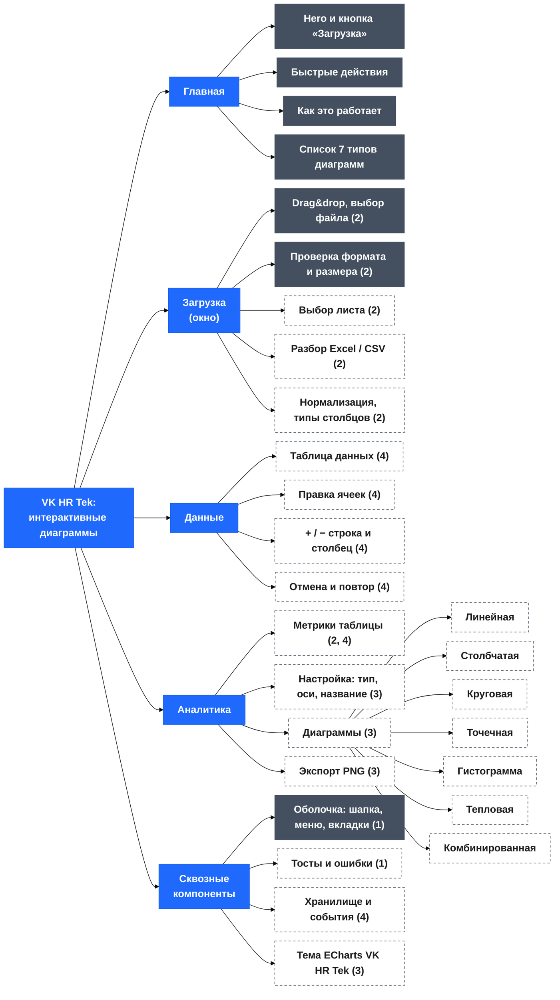

# Интерактивное построение диаграмм из Excel — VK HR Tek

HTML-инструмент: загружаешь таблицу Excel/CSV → выбираешь тип диаграммы → правишь данные прямо в интерфейсе → диаграммы пересчитываются в реальном времени.

> **Где мы сейчас:** в проекте есть только `frontend/`, и это **визуальная оболочка (макет)**. Рабочей логики нет: файл не читается, данных нет, диаграммы не строятся, редактировать нечего. Весь практический функционал (все 4 критерия по сути) ещё предстоит сделать. Backend не создавался.

Этот файл — рабочая памятка: что есть, что осталось по плану и как не сломать договорённости. Полный исходный план — [plan_html_chart_tool.md](plan_html_chart_tool.md).

## Цель и критерии приёмки

Результат согласуется с руководителем до конца отчётного периода, **допустимо не более 3 замечаний**.

| № | Критерий                                                                                                                                                                 | Модуль                | Папка                                                          | Статус                                                                                                                                         |
| -- | -------------------------------------------------------------------------------------------------------------------------------------------------------------------------------- | --------------------------- | ------------------------------------------------------------------- | ---------------------------------------------------------------------------------------------------------------------------------------------------- |
| 1  | Базовая структура и интерфейс: элементы управления, рабочая область, компоненты взаимодействия | `ui-shell`                | `frontend/src/modules/ui-shell/`                                  | 🟡 макет готов (шапка, меню, вкладки, окно); рабочая область пустая, тостов нет           |
| 2  | Загрузка и обработка Excel: импорт и подготовка данных для диаграмм                                                          | `excel-import`            | `frontend/src/modules/excel-import/`                              | 🔴 только окно выбора файла с проверкой формата и размера;**данные не читаются** |
| 3  | Построение и управление диаграммами: все типы + управление отображением                                             | `charts`                  | `frontend/src/modules/charts/`                                    | 🔴 только статичные пустые панели «Нет данных»; ECharts не подключён                                |
| 4  | Интерактивное редактирование данных с авто-пересчётом диаграмм                                                           | `data-editor` + `state` | `frontend/src/modules/data-editor/`, `frontend/src/core/state/` | 🔴 не начато                                                                                                                                 |

Обязательные 7 типов: **линейная, столбчатая, круговая, точечная, гистограмма, тепловая, комбинированная**.

## Текущее состояние (на 08.10.2026)

Сделана только внешняя часть (макет). Из «рабочего» — навигация и проверка выбранного файла. Остальное — статичная разметка:

- Оболочка: верхняя панель, выдвижное боковое меню, три вкладки по hash-маршрутам (`#home`, `#data`, `#analytics`), карточка файла в сайдбаре.
- Главная: hero-блок, быстрые действия, «Как это работает», список из 7 типов диаграмм со ссылками на фильтр.
- Окно загрузки (`<dialog>`): drag&drop + выбор файла, проверка формата (`.xlsx/.xls/.csv`), размера (≤ 10 МБ), пустого файла; понятные сообщения об ошибках.
- Вкладка «Аналитика» (статичные заглушки, значения «—»): метрики (заполненность, числовые столбцы, строк/столбцов/пропусков/дубликатов) и 7 пустых панелей диаграмм; чипы лишь прячут/показывают панели.
- Дизайн-токены VK HR Tek, шрифт Inter (локально), анимации по принципам Эмиля Ковальски (`motion.css`).

Не работает / не сделано:

- Файл после загрузки **не читается** — интерфейс лишь показывает имя и размер и пишет «после подключения обработки Excel».
- Нет хранилища данных (`store`), нет шины событий.
- Нет ни одной реальной диаграммы, нет таблицы данных.
- Нет backend (NestJS) — см. «Решения, которые нужно подтвердить».

## Скриншоты текущего фронтенда

Так выглядит готовая оболочка (макет, 1440 px). Данных и диаграмм в ней пока нет — это пустые состояния.

**Главная** — hero, быстрые действия, «Как это работает», 7 типов диаграмм:


**Данные** — пустое состояние (здесь появится редактируемая таблица):


**Аналитика** — метрики, фильтр по типу и 7 панелей диаграмм («Нет данных»):


**Окно загрузки** — drag&drop, выбор файла, проверка формата и размера:


> Скриншоты сняты headless-браузером Edge, анимации при съёмке отключены. При изменении интерфейса их нужно переснять (файлы лежат в `docs/screenshots/`).

## Схема итогового проекта

Карта разделов и блоков готового инструмента. Тёмные блоки уже есть (в виде макета), **пунктирные — предстоит сделать**. Цифры в скобках — номер критерия приёмки.



Главное правило схемы — **автопересчёт идёт только через хранилище**: правка в «Данных» → `store` → `data:changed` → перерисовка диаграмм и метрик в «Аналитике».

<details>
<summary>Та же схема текстом (если Mermaid не отображается)</summary>

```
VK HR Tek — Интерактивные диаграммы
│
├─ Главная
│   ├─ Hero и кнопка «Загрузка»                       [есть]
│   ├─ Быстрые действия                               [есть]
│   ├─ Как это работает                               [есть]
│   └─ Список 7 типов диаграмм                        [есть]
│
├─ Загрузка (модальное окно)
│   ├─ Drag&drop и выбор файла                (2)     [есть]
│   ├─ Проверка формата и размера             (2)     [есть]
│   ├─ Выбор листа                            (2)     [сделать]
│   ├─ Разбор Excel / CSV                     (2)     [сделать]
│   └─ Нормализация и типы столбцов           (2)     [сделать]
│
├─ Данные
│   ├─ Таблица данных                         (4)     [сделать]
│   ├─ Правка ячеек с проверкой типа          (4)     [сделать]
│   ├─ + / − строка и столбец                 (4)     [сделать]
│   └─ Отмена и повтор                        (4)     [сделать]
│
├─ Аналитика
│   ├─ Метрики (заполненность, строки, пропуски, дубликаты)   (2, 4)  [сделать]
│   ├─ Панель настройки: тип, оси, название, агрегация        (3)     [сделать]
│   ├─ Диаграммы                              (3)     [сделать]
│   │   ├─ Линейная        ├─ Круговая         ├─ Гистограмма
│   │   ├─ Столбчатая      ├─ Точечная         ├─ Тепловая
│   │   └─ Комбинированная
│   └─ Экспорт PNG                            (3)     [сделать]
│
└─ Сквозные компоненты
    ├─ Оболочка: шапка, меню, вкладки         (1)     [есть]
    ├─ Тосты и сообщения об ошибках           (1)     [сделать]
    ├─ Хранилище и события (store → data:changed)  (4)  [сделать]
    └─ Тема VK HR Tek для ECharts             (3)     [сделать]
```

</details>

## Фактический стек (расходится с планом — это осознанно)

В плане был Vite + TypeScript + NestJS. По факту кодовая база — **обычный JS без сборки**: скрипты подключаются тегами `<script defer>` в [frontend/index.html](frontend/index.html) и общаются через пространство имён `window.ChartTool` и `CustomEvent`. Страница открывается двойным кликом по `index.html` (проверено структурой: пути относительные, `@import` в CSS).

| Задача                                     | Решение     | Где взять                                                                                       |
| ------------------------------------------------ | ------------------ | ------------------------------------------------------------------------------------------------------- |
| Диаграммы                               | Apache ECharts 6   | уже в`frontend/node_modules/echarts/dist/echarts.min.js`                                          |
| Таблица с редактированием | Tabulator 6        | уже в`frontend/node_modules/tabulator-tables/dist/js/tabulator.min.js` (+ css из `dist/css/`) |
| Парсинг Excel                             | SheetJS (`xlsx`) | **не установлен** — см. ниже                                                   |

> ⚠️ В [frontend/package.json](frontend/package.json) прописаны скрипты `vite`, `tsc`, `vitest`, но этих пакетов нет, нет `tsconfig.json` и `vite.config.*`. Пока не решено, переходим ли на Vite/TS, эти скрипты **не работают** — не полагайся на `npm run dev/build/test`.

## Запуск

Сейчас сборка не нужна:

```
frontend/index.html   → открыть в браузере
```

Для локального сервера (нужен, например, когда начнём грузить файлы через `fetch`) — любой статический сервер из папки `frontend/`. Ничего не устанавливаем без согласования.

## Структура проекта (факт)

```
.
├─ README.md
├─ plan_html_chart_tool.md           # исходный план
├─ Референсы дизайна/                # папка референсов (сейчас пустая)
└─ frontend/
   ├─ index.html                     # вся разметка + подключение скриптов
   ├─ package.json
   └─ src/
      ├─ assets/ (logo.png, fonts/inter-*.woff2)
      ├─ modules/
      │  ├─ ui-shell/      modal.js · sidebar.js · router.js · file-status.js
      │  ├─ excel-import/  validators.js · file-dropzone.js · upload-controller.js
      │  └─ charts/        chart-filter.js
      └─ styles/
         ├─ index.css      # единственная точка подключения стилей
         ├─ tokens.css     # ВСЕ цвета/радиусы/движение — только отсюда
         ├─ base.css · fonts.css
         └─ components/    button · chips · card · app-shell · sidebar · home ·
                           empty-state · analytics · modal · dropzone · motion
```

Целевая структура — как в плане (раздел 3), с поправкой на JS без сборки. Добавить предстоит:

```
frontend/src/
├─ core/
│  ├─ state/    store.js · events.js
│  └─ utils/    detect-types.js · aggregate.js
├─ modules/
│  ├─ excel-import/  excel-parser.js · sheet-selector.js · data-normalizer.js
│  ├─ charts/        chart-manager.js · chart-panel.js · export-chart.js
│  │  ├─ builders/   line · bar · pie · scatter · histogram · heatmap · combo (.builder.js)
│  │  └─ theme/      vk-hr-tek.theme.js
│  ├─ data-editor/   data-grid.js · cell-editing.js · row-column-actions.js ·
│  │                 undo-redo.js · recalculation.js
│  └─ ui-shell/      notifications.js (тосты)
└─ vendor/           echarts.min.js · tabulator.min.js · xlsx.full.min.js (если без сборки)
```

## Правила разработки

1. **Один файл — одна ответственность**, ≲ 200 строк. Каждый модуль — отдельная папка.
2. **Таблица и диаграммы никогда не общаются напрямую — только через `core/state/store`.** Правка ячейки → `store.updateCell()` → событие `data:changed` → диаграммы перерисовываются. Это и есть критерий 4.
3. **Стили — только через CSS-переменные из [tokens.css](frontend/src/styles/tokens.css).** Никаких «сырых» hex в компонентах. Палитра диаграмм (`--chart-palette-*`) в tokens.css **ещё не добавлена** — добавить при реализации темы ECharts.
4. Тексты интерфейса и комментарии — **на русском**.
5. Разметка управляется атрибутами `data-*` (`data-when="empty|file"`, `data-modal-open`, `data-chart-type`, …). Скрипты ищут элементы по ним, а не по классам.
6. Пользовательский ввод (имя файла, значения ячеек) вставлять **только через `textContent`**, не `innerHTML`.
7. Доступность не ломать: `aria-*`, фокус на заголовке при смене вкладки, `prefers-reduced-motion`.
8. Один шаг = один результат = проверка руками, потом дальше. Не «сделай всё сразу».

## Контракты между модулями

**События (DOM `CustomEvent`).** Уже есть:

| Событие                           | Кто шлёт          | Detail       | Кто слушает                                                      |
| ---------------------------------------- | ------------------------ | ------------ | -------------------------------------------------------------------------- |
| `dropzone:file` / `dropzone:invalid` | `file-dropzone.js`     | `{ file }` | `upload-controller.js`                                                   |
| `app:file-loaded`                      | `upload-controller.js` | `{ file }` | `file-status.js` → **сюда подключить парсер** |

Добавить:

| Событие     | Когда                                                            | Подписчики                                |
| ------------------ | --------------------------------------------------------------------- | --------------------------------------------------- |
| `data:loaded`    | парсер положил таблицу в store                   | grid, charts, метрики «Аналитики» |
| `data:changed`   | изменена ячейка/строка/столбец             | `chart-manager`, метрики                   |
| `charts:changed` | добавлена/изменена/удалена диаграмма | панель диаграмм                       |

**Модель данных** (JSDoc-типы в `core/state/types.js`):

```js
/** @typedef {string|number|boolean|Date|null} CellValue */
/** @typedef {{key:string, title:string, type:'number'|'string'|'date'}} Column */
/** @typedef {{sheetName:string, columns:Column[], rows:Object<string,CellValue>[]}} DataTable */
/** @typedef {'line'|'bar'|'pie'|'scatter'|'histogram'|'heatmap'|'combo'} ChartType */
/** @typedef {{id:string, type:ChartType, title:string, xColumn?:string, yColumns:string[],
 *   seriesTypes?:Object<string,'bar'|'line'>, bins?:number, aggregation?:'sum'|'avg'|'count'}} ChartConfig */
```

Builder диаграммы — **чистая функция** `(table, config) => EChartsOption`, без обращения к DOM и store. Так её можно проверить отдельно.

## План дальнейшей работы

Порядок важен: сначала данные, потом диаграммы, потом редактирование.

### Шаг 1. Хранилище и события — фундамент для 2–4

- `core/state/store.js`: `setTable`, `updateCell`, `addRow`, `removeRow`, `addColumn`, `removeColumn`, `addChart`, `updateChart`, `removeChart`; `getTable()`, `getCharts()`.
- `core/state/events.js`: тонкая шина поверх `document.dispatchEvent` (`data:loaded`, `data:changed`, `charts:changed`).
- **Готово, когда:** из консоли `ChartTool.store.setTable(...)` вызывает `data:loaded`, `updateCell` — `data:changed`.

### Шаг 2. Критерий 2 — парсинг и подготовка Excel

- Подключить SheetJS; `excel-parser.js`: `File` → `ArrayBuffer` → workbook → `DataTable`.
- `sheet-selector.js`: если листов > 1 — выбор листа в окне загрузки.
- `data-normalizer.js`: убрать пустые строки/столбцы, найти строку заголовков, дубли имён столбцов, даты из serial-чисел Excel, числа-как-текст (`"1 234,5"`).
- `detect-types.js`: тип столбца `number | string | date` (по доле значений, с порогом).
- Подписаться на `app:file-loaded` → парсер → `store.setTable()`; ошибки — в статус окна/тост на русском.
- Если диаграммы уже есть — **спросить подтверждение** перед заменой файла.
- **Готово, когда:** `.xlsx`, `.xls`, `.csv` дают корректный `DataTable`; «грязный» файл не роняет страницу; метрики «Аналитики» (строк, столбцов, пропусков, дубликатов, заполненность) считаются по реальным данным.

### Шаг 3. Критерий 3 — диаграммы

- Подключить ECharts; `vk-hr-tek.theme.js` (палитра из `--chart-palette-*`, шрифт Inter, сетка, tooltip) — предварительно добавить палитру в tokens.css.
- `chart-manager.js`: создаёт/уничтожает экземпляры ECharts, `resize` при смене размера/сайдбара, подписка на `data:changed`/`charts:changed`.
- `chart-panel.js`: форма типа, столбцов осей, названия, агрегации (sum/avg/count); кнопка «Добавить диаграмму», удаление, смена типа.
- Builders (по одному файлу): **line, bar, pie** → затем **scatter, histogram (`bins`), heatmap (X, Y, значение), combo (`seriesTypes`)**.
- Заменить статические панели в [index.html](frontend/index.html) на динамические (сейчас 7 заготовленных `.chart-panel` с «Нет данных»); фильтр `chart-filter.js` адаптировать.
- `export-chart.js` — PNG (если успеваем).
- **Готово, когда:** все 7 типов строятся на тестовом файле; можно менять тип/оси/название, добавлять несколько диаграмм и удалять их.

### Шаг 4. Критерий 4 — редактирование и авто-пересчёт

- `data-grid.js` (Tabulator) на вкладке «Данные» отображает `store.getTable()`; заменить блок «Файл выбран» в `data-when="file"`.
- `cell-editing.js`: приведение значения к типу столбца; некорректный ввод (буквы в числовом столбце) → откат + сообщение.
- `row-column-actions.js`: «+ строка», «+ столбец», удаление.
- `recalculation.js`: подписка на `data:changed`, debounce ≈ 150 мс, перерисовка **только связанных** диаграмм и пересчёт метрик.
- Удаление столбца, на который ссылается диаграмма → диаграмма показывает подсказку «Выберите столбец», а не падает.
- `undo-redo.js` — если остаётся время (в MVP можно вынести).
- **Готово, когда:** правка любой ячейки мгновенно обновляет все связанные диаграммы и метрики.

### Шаг 5. Доводка и показ

- Тосты `notifications.js` вместо текстов в статусе там, где это уместно.
- Прогон на 2–3 реальных файлах: «чистый», «грязный», с несколькими листами.
- Краевые случаи (список ниже), консоль без ошибок, проверка на 1280 px и узкой ширине.
- `docs/test-cases.md`, раздел «Как добавить новый тип диаграммы» в этот README.
- Показ руководителю → правки (цель: **≤ 3 замечаний**) → финальная версия.

## Краевые случаи (на них чаще всего находят замечания)

- Пустые строки/столбцы, объединённые ячейки, заголовок не в первой строке.
- Числа в виде текста, даты как serial-числа Excel, несколько листов.
- Большие файлы (> 5 000 строк): ограничить/агрегировать для pie и heatmap.
- Pie с отрицательными/нулевыми значениями; heatmap без числового столбца.
- Некорректный ввод в ячейку.
- Удаление столбца, используемого в диаграмме.
- Загрузка нового файла при уже построенных диаграммах.

## Чек-лист перед показом руководителю

**Критерий 1 — интерфейс**

- [ ] Шапка, сайдбар, рабочая область, тосты
- [ ] Оформление соответствует VK HR Tek
- [ ] Нет ошибок в консоли

**Критерий 2 — Excel**

- [ ] `.xlsx` / `.xls` / `.csv` загружаются, данные попадают в таблицу
- [ ] Выбор листа, определение типов, понятные ошибки

**Критерий 3 — диаграммы**

- [ ] Линейная · столбчатая · круговая · точечная · гистограмма · тепловая · комбинированная
- [ ] Можно менять тип, оси, название; добавлять и удалять диаграммы

**Критерий 4 — редактирование**

- [ ] Правка ячейки мгновенно обновляет **все связанные** диаграммы
- [ ] Добавление/удаление строк и столбцов
- [ ] Некорректный ввод обрабатывается

**Документация**

- [ ] README (запуск, структура) · test-cases · как добавить новый тип диаграммы

## Решения, которые нужно подтвердить

1. **Сборка.** Остаёмся на JS без сборки (быстро, открывается с диска) или переходим на Vite + TypeScript, как в исходном плане? От ответа зависит, что делать с `package.json`. *Рекомендация: остаться без сборки — до показа руководителю остаётся мало времени, а всё уже написано так.*
2. **SheetJS.** Библиотеки нет в проекте. Нужен один из вариантов: положить `xlsx.full.min.js` в `frontend/vendor/` вручную или разрешить установку пакета. Без этого критерий 2 не закрыть. (По договорённости ничего не устанавливаем без явного разрешения.)
3. **Backend NestJS.** Для критериев 1–4 не нужен: парсинг идёт на клиенте. Делаем только если потребуется раздача на сервере, серверная валидация или сохранение конфигураций диаграмм.
4. **Примеры Excel.** Нужно 2–3 файла (чистый, «грязный», с несколькими листами) — по ним настроим нормализатор и проверим все типы.
5. **Референсы дизайна.** Папка «Референсы дизайна» пуста; токены сняты ранее. Если нужны правки внешнего вида — положить скриншоты туда.

## Формулировка результата для отчёта

> Разработан базовый функционал HTML-инструмента интерактивного построения диаграмм из Excel: интерфейс, загрузка и обработка файлов, 7 типов диаграмм (линейная, столбчатая, круговая, точечная, гистограмма, тепловая, комбинированная), редактирование данных с автоматическим пересчётом и обновлением диаграмм в реальном времени. Результат согласован с руководителем.
