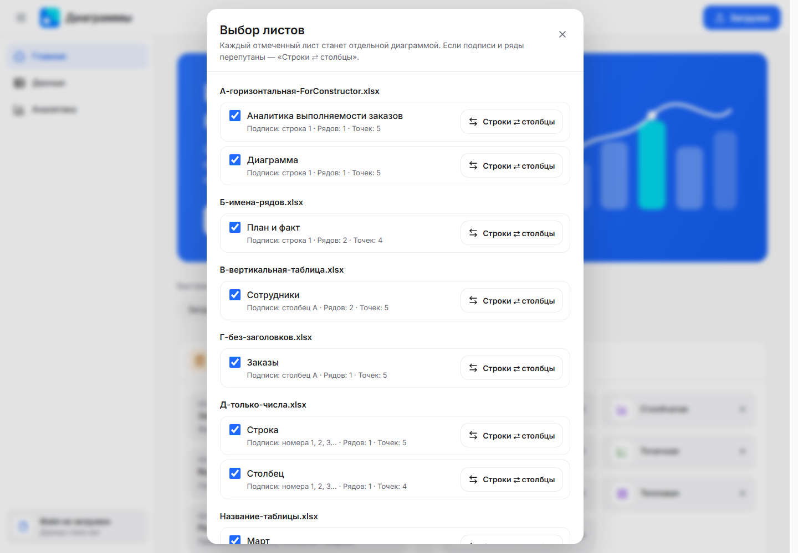
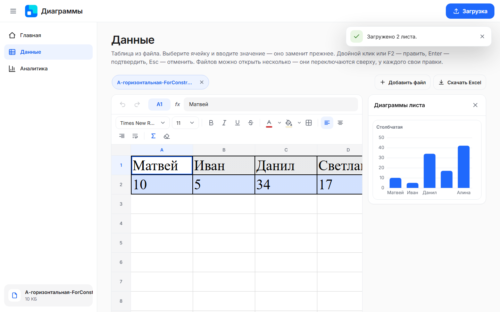
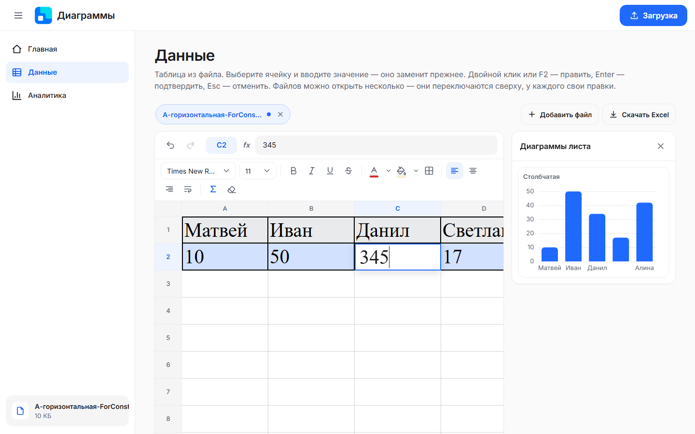
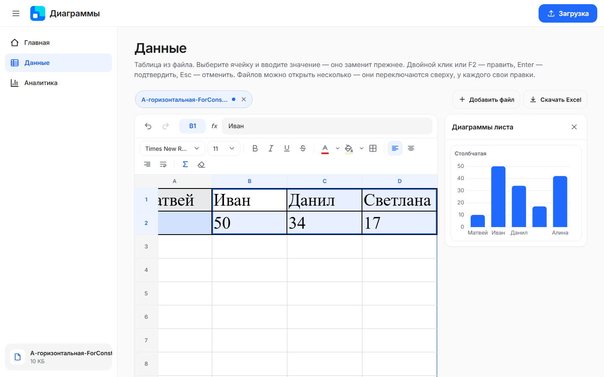
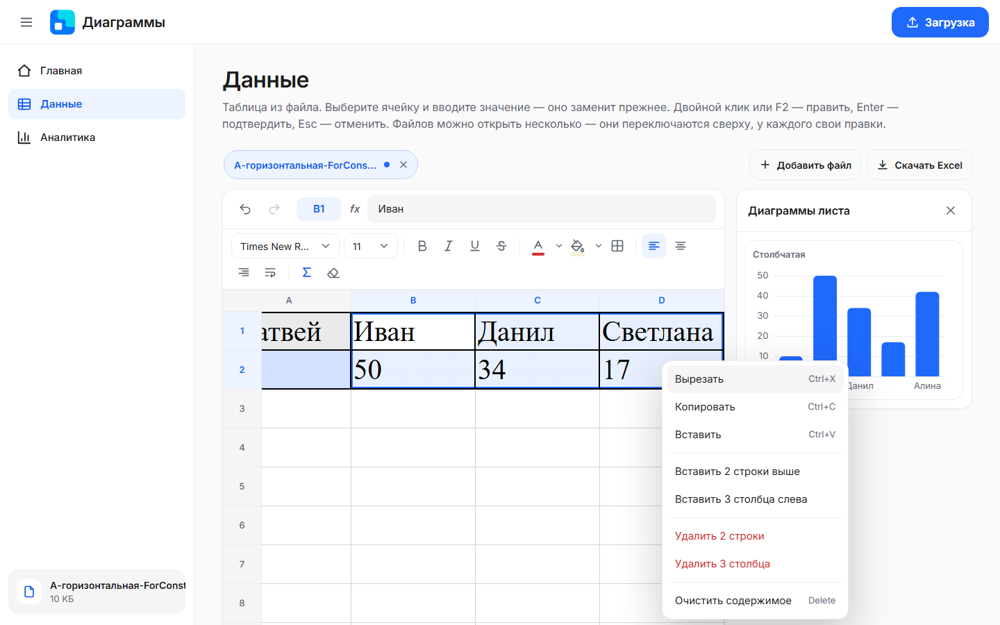
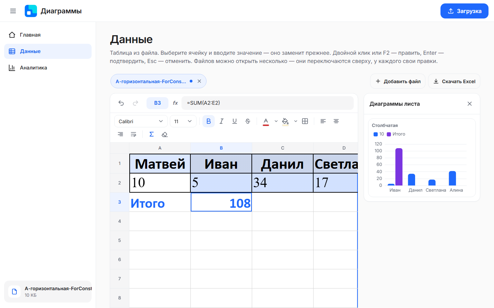
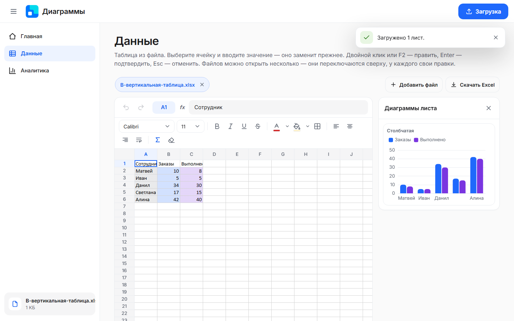
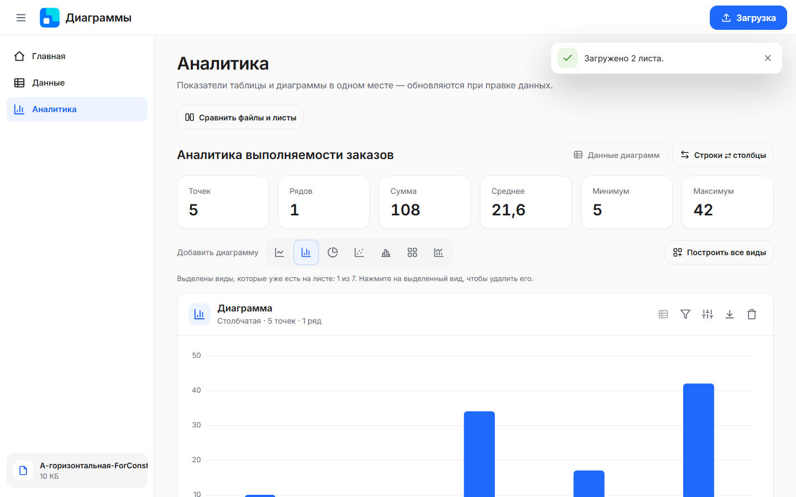
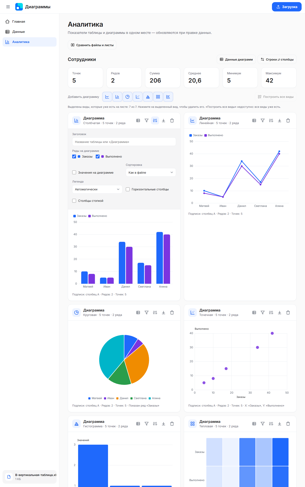
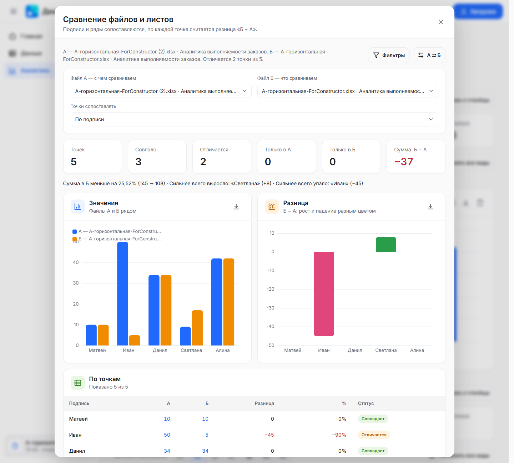

# Интерактивное построение диаграмм из Excel — VK HR Tek

Конструктор диаграмм: загружаешь Excel → **универсальный парсер** сам находит в каждом листе подписи и числовые ряды → по каждому листу сразу строится **столбчатая** диаграмма → от неё выбором типа строишь другие (7 видов, до 12 диаграмм на лист) → на вкладке «Данные» правишь таблицу **как в Excel** (значения, формулы, оформление) → все связанные диаграммы пересчитываются сразу → готовую книгу с правками можно **скачать обратно в `.xlsx`**.

> **Обновлено 9 октября 2026:**  Архитектура — **тонкий клиент**: вся логика (чтение `.xlsx`, парсер, правки, формулы, отмена и повтор, построение диаграмм, статистика, сравнение файлов, хранение, запись в `.xlsx`) живёт на **бэкенде на NestJS + TypeScript**; фронтенд только рисует интерфейс и ECharts и шлёт запросы в API. Автотесты: **175 тестов бэкенда** и **34 теста фронтенда** — все проходят. Скриншоты ниже сняты с работающей версии.

**Условные обозначения:** ✅ сделано · 🟡 частично · 🔴 не начато.

## Содержание

1. [Что сделано](#что-сделано)
2. [Цель и критерии приёмки](#цель-и-критерии-приёмки)
3. [Принятые решения](#принятые-решения)
4. [Универсальный парсер](#универсальный-парсер)
5. [7 видов диаграмм](#7-видов-диаграмм)
6. [Скриншоты](#скриншоты)
7. [Архитектура](#архитектура)
8. [API](#api)
9. [Структура проекта](#структура-проекта)
10. [Запуск и проверка](#запуск-и-проверка)
11. [Правила разработки](#правила-разработки)
12. [Как добавить новый вид диаграммы](#как-добавить-новый-вид-диаграммы)
13. [Журнал проделанной работы](#журнал-проделанной-работы)
14. [Краевые случаи](#краевые-случаи)
15. [Чек-лист перед показом](#чек-лист-перед-показом-руководителю)
16. [Что сознательно не делаем](#что-сознательно-не-делаем)
17. [Формулировка результата для отчёта](#формулировка-результата-для-отчёта)

## Что сделано

**Загрузка и разбор (критерий 2)**

- ✅ Окно загрузки: выбор нескольких файлов и drag&drop, проверка формата (только `.xlsx`; на `.xls` и `.csv` — подсказка «сохраните как .xlsx»), пустого файла. Размер не ограничен (защита — потолок распаковки 50 МБ против архива-«бомбы»).
- ✅ Чтение `.xlsx` **на сервере** своим кодом вместе с оформлением: шрифты, цвета, заливки, рамки, объединённые ячейки, ширины и высоты, скрытые строки и столбцы, масштаб, числовые форматы и даты; формулы — значение и текст.
- ✅ Универсальный парсер (раскладки А–Д, название таблицы, несколько таблиц на листе, журналы «записей» с подсчётом по столбцу, числа с единицами и прочерки).
- ✅ Окно «Выбор листов»: отчёт разбора, галочки, «⇄ Строки ⇄ столбцы». Файлы открываются рядом (до 10), у каждого свои правки.

**Диаграммы (критерий 3)**

- ✅ 7 видов: линейная, столбчатая, круговая, точечная, гистограмма, тепловая, комбинированная. Настройки опций ECharts строит **бэкенд** (builders), браузер подставляет цвета темы и рисует.
- ✅ Переключатель вида, ⚙ настройки (заголовок, ряды, значения, сортировка, легенда, параметр под вид), «добавить / дублировать / построить все виды / удалить» (до 12 на лист), экспорт PNG, клик по столбцу или точке ведёт к ячейке.
- ✅ **Фильтры диаграммы**: выбор точек галочками и условия (значение от–до, N наибольших/наименьших, «подпись содержит / не содержит», выше/ниже среднего ряда, без пустых, без нулей).
- ✅ **«Данные диаграмм»**: что взять за основу и что считать (количество записей, сумма, среднее, минимум, максимум), как поля сводной диаграммы.
- ✅ **Сравнение двух файлов и листов**: плитки, диаграммы «Значения» и «Разница», таблица «По точкам», фильтр сравнения.
- ✅ Итоги листа: точек, рядов, сумма, среднее, минимум, максимум.

**Редактирование как в Excel (критерий 4)**

- ✅ Сетка с буквами и номерами (строки рисуются окном — лист на 100 000 строк не тормозит), строка формул, ярлыки листов, вкладки файлов.
- ✅ Клавиатура, ввод, F2, Esc, Delete, выделение диапазонов (мышью, Shift, Ctrl+стрелки, строки и столбцы целиком), итоги по выделенному.
- ✅ Буфер обмена в обе стороны с Excel, вставка и удаление строк и столбцов, отмена и повтор (до 200 шагов на лист), «Сбросить к данным из файла».
- ✅ **Оформление**: шрифт и размер, Ж/К/Ч/зачёркнутый, цвета текста и заливки, выравнивание, перенос, границы, «Очистить формат».
- ✅ **Формулы**: SUM, AVERAGE, MIN, MAX, COUNT, COUNTA, MEDIAN, PRODUCT, ROUND*, ABS, SQRT, POWER, MOD, IF, IFERROR, AND, OR, NOT, SUMIF, COUNTIF, CONCAT, LEN, UPPER, LOWER (русские и английские имена, `;` и `,`), ссылки и диапазоны, кнопка Σ; пересчёт после любой правки, сдвиг ссылок при вставке и удалении, защита от циклов. Формулы на другие листы, имена и массивы не поддерживаются.
- ✅ Подсветка подписей и рядов цветами диаграмм, строка отчёта разбора, **предпросмотр диаграмм** рядом с таблицей (пересчитывается при правке).
- ✅ **Скачать Excel** — книга с правками, оформлением и формулами сохраняется в `.xlsx`.
- ✅ Состояние переживает перезагрузку страницы **и перезапуск сервера**: книги лежат на сервере (`backend/data/<id>.json`), выбранные файл, лист, выделение и прокрутка — в браузере.

**Оболочка (критерий 1)**

- ✅ Шапка, выдвижное меню, вкладки «Главная / Данные / Аналитика», тосты, пустые состояния, дизайн-токены VK HR Tek, шрифт Inter (локально), свои выпадающие списки и подсказки; адаптив проверен на 1440, 1280 и 390 px.

## Цель и критерии приёмки

| № | Критерий                                                                                                                                                                        | Модуль                                | Статус                                                                                                                                                                                                                                                                                      |
| -- | --------------------------------------------------------------------------------------------------------------------------------------------------------------------------------------- | ------------------------------------------- | ------------------------------------------------------------------------------------------------------------------------------------------------------------------------------------------------------------------------------------------------------------------------------------------------- |
| 1  | Базовая структура и интерфейс: элементы управления, рабочая область, компоненты взаимодействия        | `ui-shell`                                | ✅ шапка, меню, вкладки, окна «Загрузка», «Выбор листов», «Сравнение», «Данные диаграмм», тосты, пустые состояния, адаптив                                                                       |
| 2  | Загрузка и обработка Excel: импорт табличных данных и их подготовка для диаграмм                                         | `excel-import` + бэкенд `excel/`  | ✅ загрузка, чтение`.xlsx` с оформлением на сервере, универсальный парсер, выбор листов, примеры в `docs/examples/`                                                                                                  |
| 3  | Построение и управление диаграммами: разные типы визуализаций и управление отображением                    | `charts` + бэкенд `excel/charts/` | ✅ 7 видов, переключатель, настройки ⚙, фильтры, добавить / дублировать / все виды / удалить, PNG, сравнение файлов                                                                                            |
| 4  | Интерактивное редактирование данных с автоматическим пересчётом и обновлением связанных диаграмм | `data-editor` + бэкенд              | ✅ сетка как в Excel, формулы, оформление, буфер, строки и столбцы, отмена и повтор, пересчёт диаграмм и итогов после каждой правки, предпросмотр, сохранение в`.xlsx` |

## Принятые решения

| Вопрос                                                                                      | Решение                                                                                                                                                                                                                                                                                                                                                                                    | Источник                        |
| ------------------------------------------------------------------------------------------------- | ------------------------------------------------------------------------------------------------------------------------------------------------------------------------------------------------------------------------------------------------------------------------------------------------------------------------------------------------------------------------------------------------- | --------------------------------------- |
| Формат входных таблиц                                                          | **Универсальный парсер**, а не «один лист = одна диаграмма»                                                                                                                                                                                                                                                                                    | руководитель                |
| Что строится сразу                                                                | **Столбчатая**; от неё другие — выбором типа                                                                                                                                                                                                                                                                                                               | руководитель                |
| Данные для работы                                                                  | Есть только`ForConstructor.xlsx`; остальные раскладки проверяем на своих файлах (`docs/examples/`)                                                                                                                                                                                                                                          | руководитель                |
| Форматы файлов                                                                       | Только Excel (`.xlsx`); `.xls` и CSV не поддерживаем                                                                                                                                                                                                                                                                                                                     | решено                            |
| Где редактировать                                                                 | Вкладка «Данные» — редактирование как в Excel                                                                                                                                                                                                                                                                                                                   | решено                            |
| **Backend**                                                                                 | ✅**NestJS + TypeScript** (11-я версия, Express). Один `npm install` в `backend/`                                                                                                                                                                                                                                                                                           | решено (пользователь) |
| **Тонкий клиент** (9.10.2026)                                                   | Парсер, правки, формулы, история, диаграммы, статистика и хранение — на бэкенде; фронтенд только отображает и вызывает API. Старое правило «фронтенд работает и без сервера»**отменено**, офлайн-режим `file://` убран | решено (пользователь) |
| Диаграммы                                                                                | Apache ECharts 6 (`frontend/vendor/echarts.min.js`), опции строит бэкенд                                                                                                                                                                                                                                                                                                       | решено                            |
| Фронтенд                                                                                  | JS без сборки, скрипты`<script defer>`, общий объект `window.ChartTool`                                                                                                                                                                                                                                                                                            | решено                            |
| SheetJS, Tabulator                                                                                | Не используем — чтение и запись`.xlsx` свои (`zip-reader`, `xlsx-reader`, `zip-writer`, `xlsx-writer`)                                                                                                                                                                                                                                                    | решено                            |
| Гистограмма, тепловая, комбинированная на одном ряду | Распределение по интервалам · полоса клеток · столбцы + линия среднего                                                                                                                                                                                                                                                                 | по умолчанию                 |

## Универсальный парсер

Парсер берёт **любой лист** и сам определяет, где **подписи** (точки по оси X) и где **числовые ряды**. Результат для любого листа один: `подписи[] + ряды[{имя, значения[]}]`. Парсер — чистая функция «сетка → данные для диаграмм» (`backend/src/excel/table-parser.ts`); он запускается при загрузке и **после каждой правки**, поэтому любая правка доходит до диаграмм.

| Раскладка                                                      | Пример                                                                   | Подписи         | Ряды                                            |
| ----------------------------------------------------------------------- | ------------------------------------------------------------------------------ | ---------------------- | --------------------------------------------------- |
| **А. Горизонтальная**                              | `Матвей Иван Данил` / `10 5 34`                             | строка 1         | строки 2, 3…                                 |
| **Б. Горизонтальная с именами рядов** | `— Янв Фев Мар` / `План 10 12 9`                             | строка 1         | строки 2+, имя — столбец A         |
| **В. Вертикальная (обычная таблица)**  | `Сотрудник Заказы Выполнено` / `Матвей 10 8` | столбец A       | столбцы B, C…, имя — заголовок |
| **Г. Вертикальная без заголовков**      | `Матвей 10` / `Иван 5`                                           | столбец A       | столбец B                                    |
| **Д. Только числа**                                   | `10 5 34 17 42`                                                              | номера 1, 2, 3… | каждая строка (или столбец)   |

Как работает: лист читается в сетку → пустые края отбрасываются → название таблицы над данными идёт в заголовок диаграммы → ориентация определяется по тому, где текст, а где числа (при равенстве — по более длинной стороне; поправить можно «⇄») → в ряды попадают только числовые строки/столбцы, текстовые («Комментарий») пропускаются с пометкой в отчёте → число-как-текст (`"3,5"`, `"1 234"`, `"14 шт"`), формулы и даты читаются как числа и даты, «—» и «н/д» — «значения нет».

Для реальных выгрузок: лист с несколькими таблицами делится на блоки (`block-finder.ts`, по умолчанию берётся самая заполненная; другую выбирают в окне «Выбор листов»); таблицу-журнал без чисел парсер превращает в «записи» — считает количество, сумму или среднее по выбранному столбцу (окно «Данные диаграмм»). Выбор хранится на листе и идёт вслед за вставкой и удалением строк и столбцов.

**Как пользователь поправляет парсер:** галочки и «⇄» при загрузке; «⇄» и «Данные диаграмм» на «Аналитике»; выбор рядов в ⚙ карточки; подсветка на «Данных» показывает, что именно взял парсер.

## 7 видов диаграмм

Все 7 видов реально различаются и работают и с одним рядом, и с несколькими.

| Вид                                                   | Один ряд                                               | Несколько рядов                                 | Параметры                                                                     |
| -------------------------------------------------------- | ------------------------------------------------------------- | ------------------------------------------------------------- | -------------------------------------------------------------------------------------- |
| Линейная                                         | линия через точки                              | по линии на ряд                                   | сглаживание                                                                 |
| **Столбчатая** (по умолчанию) | столбец на точку                                | группы рядом или стопкой                 | вертикально / горизонтально, рядом / стопкой       |
| Круговая                                         | доли от суммы                                      | доли выбранного ряда                        | круг / кольцо, какой ряд; малые доли — в «Прочее» |
| Точечная                                         | X — подписи, Y — значения                    | X — один ряд, Y — другой                       | какие ряды по осям                                                      |
| Гистограмма                                   | распределение по интервалам          | распределение выбранного ряда      | какой ряд, число интервалов                                     |
| Тепловая                                         | полоса клеток от светлой к тёмной | матрица «ряды × подписи»                 | шкала цвета                                                                  |
| Комбинированная                           | столбцы + линия среднего                  | один ряд столбцами, другой линией | линия среднего / накопленного итога / ряд             |

Настройки отображения и фильтры меняют **только вид** диаграммы — данные листа они не трогают.

## Скриншоты

Сняты 9 октября 2026 с работающей версии (Edge headless, 1440 px, если не указано другое, анимации отключены).
(Сценарий съёмки — `docs/screenshots/`)

**Главная** — hero, быстрые действия, «Как это работает», 7 видов:


**Данные** и **Аналитика** до загрузки файла — пустые состояния:


**Окно загрузки** — drag&drop и выбор файлов:


**Выбор листов** — все примеры из `docs/examples/` разом: отчёт разбора, галочки, «⇄»:



**Данные** — `ForConstructor.xlsx`: таблица как в Excel, отмена и повтор, строка формул, панель оформления, предпросмотр диаграммы:



**Данные** — правка: в B2 введено 50 (лист помечен изменённым, диаграмма уже пересчитана), в C2 набирают 345:



**Данные** — диапазон B1:D2: рамка, белая активная ячейка, подсвеченные буквы и номера:



**Данные** — контекстное меню: вырезать / копировать / вставить, вставка и удаление строк и столбцов:



**Данные** — оформление и формулы: шапка с заливкой и жирным шрифтом, в B3 формула `=SUM(A2:E2)` (видна в строке формул), итог 108 попал в диаграмму:



**Данные** — подсветка подписей и рядов цветом диаграммы, справа предпросмотр:



**Аналитика** — два листа `ForConstructor.xlsx` = два блока с итогами и диаграммами:



**Аналитика** — панель «Добавить диаграмму», «Построить все виды», карточка (1280 px):


**Аналитика** — все 7 видов по одному листу (1440×2300), у столбчатой открыты настройки ⚙:



**Настройки диаграммы ⚙** крупнее:


**Фильтры диаграммы** — выбор точек и условия:


**Данные диаграмм** — основа и что считать:


**Сравнение файлов и листов** — два файла, плитки, диаграммы «Значения» и «Разница», таблица по точкам:



**Предел диаграмм на листе** — 12 диаграмм, кнопки добавления отключены, под панелью объяснение:


**Телефон, 390 px:**


## Архитектура

### Тонкий клиент

```
Браузер (frontend/)                         Сервер (backend/, NestJS)
────────────────────                        ───────────────────────────────────────────
интерфейс, сетка, ECharts   ── fetch ──►    /api/excel/…  контроллеры → ExcelService
событийная шина, store                      ├─ чтение .xlsx (zip-reader, xlsx-reader, стили)
(кэш ответов сервера)       ◄── JSON ──     ├─ сетка, правки, формулы, формат, история
                                            ├─ парсер таблиц, блоки, «записи»
                                            ├─ диаграммы: конфиги, данные, builders → опции ECharts
                                            ├─ статистика, сравнение листов
                                            ├─ запись в .xlsx (zip-writer, xlsx-writer)
                                            └─ хранение: память + backend/data/<id>.json
```

Источник правды — **сетка листа** на сервере. Данные для диаграмм — производные: их каждый раз заново считает парсер. Поэтому любая правка (число, подпись, формула, вставка строки, вставка из буфера) автоматически доходит до диаграмм. Ответ на правку содержит изменение, разбор листа и состояние истории — браузер обновляет сетку, итоги и перерисовывает диаграммы листа.

Запросы к одному файлу идут **строго по очереди** (`frontend/src/api/excel-api.js`): диаграмма не построится по данным «до правки».

Сборка опций ECharts — на сервере; вместо функций и цветов темы в них стоят метки (`$color`, `$heat`, `$theme`, `$fmt`), которые браузер подставляет перед отрисовкой (`chart-render.js`). Цвета диаграмм берутся из токенов `--chart-*` (`tokens.css`).

Правило: **таблица «Данных» и диаграммы общаются только через `core/state/store`**.

### События фронтенда (DOM `CustomEvent`)

| Событие        | Когда                                                                                                                | Подписчики                                                                |
| --------------------- | ------------------------------------------------------------------------------------------------------------------------- | ----------------------------------------------------------------------------------- |
| `data:loaded`       | книги получены с сервера и лежат в store                                                      | оболочка, сетка, вкладки, диаграммы                    |
| `data:changed`      | изменилась сетка листа (правка, формат, вставка, отмена, сброс, «⇄») | сетка, строка формул, статус, итоги, диаграммы |
| `sheet:active`      | выбран другой лист                                                                                        | сетка, строка формул, вкладки                               |
| `selection:changed` | сменилось выделение                                                                                     | сетка, строка формул, итоги по выделенному       |
| `charts:changed`    | диаграмма добавлена, изменена, удалена                                                   | менеджер диаграмм, предпросмотр, отчёт             |
| `cell:goto`         | клик по фигуре диаграммы                                                                             | переход на «Данные» к ячейке                                |

### Хранение

Открытые книги (до 10) сервер держит в памяти и пишет на диск по файлу на книгу (`DATA_DIR`, по умолчанию `backend/data/`). После перезагрузки страницы или перезапуска сервера они на месте, с правками, оформлением и диаграммами. В браузере (localStorage) — только состояние интерфейса.

## API

Все ответы — JSON; успех содержит `ok: true`, ошибка — `{ ok: false, message }` с текстом для показа пользователю (фильтр `ApiExceptionFilter`). Подробные комментарии — в контроллерах `backend/src/excel/*.controller.ts`.

| Группа                                                    | Запросы                                                                                                                                                                                                                                                                                                                                                               |
| --------------------------------------------------------------- | ---------------------------------------------------------------------------------------------------------------------------------------------------------------------------------------------------------------------------------------------------------------------------------------------------------------------------------------------------------------------------- |
| Здоровье                                                | `GET /api/health`                                                                                                                                                                                                                                                                                                                                                          |
| Книги                                                      | `POST /api/excel/upload` (multipart, поле `file`) · `GET /api/excel/files` · `GET /api/excel/:fileId` · `DELETE /api/excel/:fileId` · `POST …/:fileId/preview` («⇄» в окне выбора) · `POST …/:fileId/parse` (открыть выбранные листы) · `POST …/:fileId/save` (скачать `.xlsx` с правками) |
| Правки листа`/api/excel/:fileId/sheet/:sheetId/…` | `PATCH cell` · `PATCH range` · `POST clear` · `PATCH format` · `POST autosum` · `POST insert-rows` / `delete-rows` / `insert-cols` / `delete-cols` · `POST undo` / `redo` / `reset`                                                                                                                                                            |
| Разбор листа                                         | `POST transpose` (⇄) · `PATCH source` (таблица и счёт записей) · `POST range-stats` (итоги по выделенному)                                                                                                                                                                                                                     |
| Диаграммы листа                                   | `POST charts` (добавить) · `POST charts/all` («построить все виды»)                                                                                                                                                                                                                                                                           |
| Диаграммы`/api/excel/:fileId/chart/…`               | `POST build` (опции ECharts + данные + итоги) · `PATCH :chartId` · `DELETE :chartId` · `POST :chartId/duplicate`                                                                                                                                                                                                                                  |
| Сравнение                                              | `POST /api/excel/compare`                                                                                                                                                                                                                                                                                                                                                  |
| Статика                                                  | `GET /…` — раздача `frontend/` (без скрытых файлов, `node_modules`, списков папок и всего за пределами `frontend/`)                                                                                                                                                                                            |

Порт, адрес и папка данных — переменные окружения `PORT` (3000), `HOST` (`127.0.0.1`, только этот компьютер), `DATA_DIR`, `FRONTEND_DIR`.

## Структура проекта

```
.
├─ README.md
├─ start.bat                       # двойной клик: ставит зависимости (первый раз), собирает, запускает сервер, открывает сайт
├─ plan_html_chart_tool.md         # исходный план (частично устарел)
├─ ForConstructor.xlsx             # пример от руководителя
├─ docs/
│  ├─ test-cases.md                # ручные сценарии приёмки
│  ├─ examples/                    # примеры .xlsx раскладок А–Д + make-examples.cjs (генератор)
│  └─ screenshots/                 # скриншоты для README
├─ backend/                        # NestJS + TypeScript
│  ├─ package.json · tsconfig.json
│  ├─ data/                        # книги на диске (по файлу на книгу)
│  ├─ src/
│  │  ├─ main.ts · app.factory.ts · app.module.ts
│  │  ├─ common/                   # config · http-error · api-exception.filter · launcher (открыть браузер)
│  │  ├─ static/                   # раздача frontend/ с защитой путей, mime-types
│  │  ├─ health/
│  │  └─ excel/
│  │     ├─ files / sheets / charts / compare .controller.ts   # маршруты
│  │     ├─ excel.service.ts · file-storage.ts · history-manager.ts · model.ts · validators.ts
│  │     ├─ zip-reader · xlsx-reader · import/(xlsx-styles, xml-dom) · zip-writer · xlsx-writer
│  │     ├─ table-parser · block-finder · grid-codec · sheet-view · stats-calculator
│  │     ├─ cell-editor · cell-format · recalc · core/(формулы, адреса, сетка, числа)
│  │     ├─ chart-builder · charts/(chart-config, chart-data, chart-store, builders/{bar,line,pie,scatter,histogram,heatmap,combo,common})
│  │     └─ compare/sheet-compare.ts
│  └─ test/                        # 175 тестов на node:test
└─ frontend/                       # браузер: только интерфейс
   ├─ index.html                   # вся разметка и подключение скриптов (порядок важен)
   ├─ vendor/echarts.min.js
   ├─ test/                        # 34 теста на node:test
   └─ src/
      ├─ api/excel-api.js          # клиент API (очередь запросов на файл)
      ├─ core/state/               # events · store · session · chart-config · types
      ├─ core/utils/               # cell-address · grid-layout · grid-utils · parse-number · prefs · tsv
      ├─ modules/
      │  ├─ ui-shell/              # modal · sidebar · router · notifications · context-menu · dropdown · tooltip · file-status
      │  ├─ excel-import/          # file-dropzone · upload-controller · import-controller · sheet-picker · validators
      │  ├─ data-editor/           # сетка, выделение, правка, клавиатура, буфер, строка формул, панель оформления,
      │  │                         # вкладки листов и файлов, подсветка, отчёт, предпросмотр, скачивание Excel
      │  └─ charts/                # chart-manager · chart-card · chart-settings · chart-filters · chart-source ·
      │                            # chart-actions · chart-render · compare-panel · export-png · theme
      └─ styles/                   # tokens.css (все цвета и размеры) · base · fonts · components/*
```

## Запуск и проверка

Нужен Node.js ≥ 22.

1. **Двойной клик по `start.bat`** — самый простой способ. Первый запуск ставит зависимости сервера (`npm install`), затем сервер собирается (если код менялся) и открывается http://localhost:3000. Окно не закрывать, пока работаете; остановка — Ctrl+C. Повторный запуск при работающем сервере просто открывает сайт. Другой порт — `set PORT=3001` в этом окне перед запуском.
2. **Из командной строки** (в папке `backend`): `npm install` → `npm run build` → `npm start` (или `npm run start:open` — ещё и открыть браузер). Разработка: `npm run dev` (пересборка при правках).
3. **Без сервера интерфейс не работает** — это сознательное решение (тонкий клиент).

**Проверка**

- `npm test` в `backend` — собирает проект и запускает ✅ **175 тестов**: чтение и запись `.xlsx` (круг «читаем → пишем → читаем»), парсер, формулы и форматирование, правки сетки и истории, диаграммы и builders, статистика, сравнение, хранилище, API, запуск.
- `npm test` в `frontend` — ✅ **34 теста** чистой логики (формат буфера, раскладка сетки, утилиты, хранилище, отрисовка опций).
- Поведение в браузере проверялось в Edge, Chrome, Yandex (загрузка, выбор листов, 7 видов, правка, формулы, оформление, сравнение, перезагрузка, 1440 / 1280 / 390 px, консоль без ошибок) — ручные сценарии в [docs/test-cases.md](docs/test-cases.md).

## Правила разработки

1. **Один файл — одна ответственность**, ≲ 200 строк. Каждый модуль — отдельная папка.
2. **Логика — на бэкенде, фронтенд — только отображение и вызовы API.** Дублировать расчёты в браузере нельзя.
3. **Таблица «Данных» и диаграммы общаются только через store.**
4. **Никаких зашитых подписей, названий листов и значений из примера** — парсер универсальный.
5. **Стили — только через CSS-переменные из [tokens.css](frontend/src/styles/tokens.css)**; цвета подсветки рядов на «Данных» = цвета рядов на диаграммах.
6. Тексты интерфейса и комментарии — **на русском**.
7. Скрипты находят элементы по атрибутам `data-*`, а не по классам.
8. Данные из файла и ввод пользователя — **только через `textContent`**, не `innerHTML`.
9. Доступность не ломать: `aria-*`, фокус при смене вкладки, `prefers-reduced-motion`; у сетки роли `grid` / `gridcell`.
10. Новый маршрут — в контроллер `backend/src/excel/` с комментарием о контракте и тестом; изменение контракта отражать в разделе «API».
11. **После каждого шага отмечать сделанное в этом README.**

## Как добавить новый вид диаграммы

1. **Тип** — добавить в `TYPES` и `NAMES` в `backend/src/excel/charts/chart-config.ts` (порядок = порядок иконок); иконку `i-<тип>` — в спрайт `frontend/index.html`; тип — в `frontend/src/core/state/chart-config.js`.
2. **Builder** — файл `backend/src/excel/charts/builders/<тип>.builder.ts`: чистая функция `(data, display, context) → опции ECharts`. Цвета — меткой `{ $color: n }`, форматтеры — `{ $fmt: … }` (см. `common.ts`). Необязательно: `notes(data, display)` — пояснение под диаграммой. Подключить в `chart-builder.ts`.
3. **Настройки вида** — строка в схеме полей `frontend/src/modules/charts/chart-settings.js`; значение попадёт в `display`.
4. **Проверка** — тест в `backend/test/charts.test.ts` и ручной прогон на `docs/examples/`.

## Журнал проделанной работы

Порядок — хронологический, всё отмечено выполненным.

- [X] Макет оболочки: главная, меню, вкладки, окно загрузки, дизайн-токены VK HR Tek.
- [X] Чтение `.xlsx` и хранилище; «Данные» как в Excel: правка, диапазоны, буфер, строки и столбцы, отмена и повтор.
- [X] Универсальный парсер (раскладки А–Д, названия таблиц, годы и даты, несколько таблиц на листе, журналы-«записи»), окно «Выбор листов».
- [X] «Аналитика»: блок на лист, итоги, ECharts + тема, все 7 видов, настройки ⚙, добавить / дублировать / все виды / удалить, PNG, фильтры диаграмм.
- [X] «Данные» ↔ диаграммы: подсветка, отчёт разбора, предпросмотр, переход от фигуры к ячейке.
- [X] Бэкенд (сначала Node.js без зависимостей — раздача и проверка файла); затем **переход на NestJS + TypeScript**.
- [X] **Тонкий клиент (9.10.2026):** парсер, правки, история, диаграммы, статистика и хранение переехали на бэкенд; браузерные копии логики и офлайн-режим удалены; запросы к файлу идут по очереди.
- [X] Оформление и формулы в редакторе; Σ; пересчёт со сдвигом ссылок; сохранение оформления и формул в `.xlsx`.
- [X] **Скачать Excel** — запись книги с правками (`zip-writer`, `xlsx-writer`).
- [X] Хранение книг на диске, переживают перезапуск сервера; до 10 файлов одновременно.
- [X] Сравнение двух файлов и листов с фильтром; новые условия фильтра диаграммы; «Данные диаграмм».
- [X] Тесты: 175 бэкенда + 34 фронтенда — все проходят.
- [X] `start.bat` (установка зависимостей, сборка, запуск, открытие браузера).
- [X] README и все скриншоты обновлены под текущую версию (9.10.2026).

## Краевые случаи

Отмечено `[x]` — проверено (автотесты бэкенда и Edge).

- [X] Пустые ячейки посреди таблицы, пустые края, объединённые ячейки (значение из левой верхней), заголовок таблицы над данными, пустая A1.
- [X] Неоднозначная ориентация — по длинной стороне, «⇄» выручает; годы и даты в подписях; повторяющиеся и очень длинные подписи.
- [X] Запятая в дробях, пробелы в тысячах, числа с единицами, прочерки, формулы, ошибки Excel (`#DIV/0!`), логические значения.
- [X] Скрытые листы и листы-диаграммы пропускаются с причиной; `.xls`, `.csv`, пустой, повреждённый, защищённый паролем файл, архив без книги, архив-«бомба» — понятные сообщения, прежние данные на месте.
- [X] Лист на 100 000 строк (в DOM только окно строк); сотни точек и рядов на диаграмме (до 2000 точек и 50 рядов, ползунок и колесо мыши).
- [X] Круговая с нулями и отрицательными значениями; гистограмма из одной точки или одинаковых значений.
- [X] Формулы: ссылки на другие листы и неизвестные функции отклоняются с объяснением, циклические ссылки отклоняются, удалённая ссылка → `#REF!`.
- [X] Вставка блока из Excel с кавычками, переводами строк и пустыми ячейками; одно значение заполняет диапазон.
- [X] Русское имя файла, одинаковые имена листов при записи, запрещённые символы в именах листов.
- [X] Сервер недоступен — понятное сообщение «Сервер не запущен»; путь вида `/../` и скрытые файлы не отдаются.

## Чек-лист перед показом руководителю

**Критерий 1 — интерфейс**

- [X] Шапка, меню, окна, тосты, пустые состояния
- [X] «Данные»: сетка, строка формул, панель оформления, ярлыки листов и файлов
- [X] «Аналитика»: блок на каждый лист, итоги, карточки, панель действий
- [X] Оформление VK HR Tek; консоль без ошибок; 1440, 1280 и 390 px без горизонтальной прокрутки

**Критерий 2 — Excel**

- [X] `ForConstructor.xlsx` → 2 листа, подписи и значения как в Excel
- [X] Раскладки Б, В, Г, Д, название таблицы, «Разные листы» разобраны верно (`docs/examples/`)
- [X] Выбор листов галочками; «⇄» работает
- [X] Только Excel: `.csv` не принимается, на `.xls` — понятное сообщение

**Критерий 3 — диаграммы**

- [X] Сразу после загрузки — столбчатая по каждому листу
- [X] От столбчатой кликом по иконке — любой из 7 видов
- [X] По листу — несколько диаграмм (добавить, дублировать, все виды, удалить; до 12)
- [X] У каждой своё отображение: вид, ряды, заголовок, значения, сортировка, легенда, параметр под вид, фильтры
- [X] Экспорт PNG; сравнение файлов

**Критерий 4 — редактирование**

- [X] Клавиатура, выделение, буфер, строки и столбцы, отмена и повтор, «Сбросить»
- [X] Правка значения или формулы сразу обновляет **все** диаграммы листа и итоги
- [X] Оформление ячеек; формулы; Σ
- [X] Подсветка подписей и рядов; предпросмотр на «Данных»
- [X] «Скачать Excel» отдаёт файл с правками

**Бэкенд и документация**

- [X] `start.bat` поднимает сервер, сайт открывается на http://localhost:3000
- [X] `npm test` в `backend` (175) и `frontend` (34) проходят
- [X] README актуален, [docs/test-cases.md](docs/test-cases.md), скриншоты пересняты
